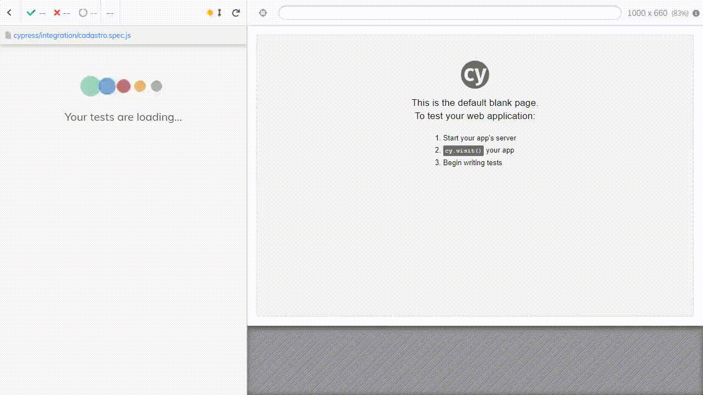

# Automação de um E-commerce utilizando Cypress
 
 ### Execução do Teste

<p align="center">
  
</p>

 ### Descrição
 
 Esse repositório você encontrará automação em Cypress de um E-commerce. Esse defafio foi proposto no Módulo 3 do Agilizei Bootcamp. 
 
 ### Preparação para Executar a Automação

1. [Instalar a linguagem (Node.js)](https://nodejs.org)

2. Na raiz do projeto, execute para realizar a instalação do projeto e dependências:

```javascript
npm install
```
3. Execute o teste automatizado em modo headless:
```javascript
npm run cy:run
```
4. Execute o comando a seguir para mesclar as saídas das spec em um único arquivo:

```javascript
npm run report:merge
```
5. Execute o comando a seguir para gerar o relátorio em html dos resultados mergeados:

```javascript
npm run report:mocha
```
6. Após a geração do relatório, execute o comando a seguir para excluir do projeto a sujeira da execução do teste:

```javascript
npm run report:clean
```
7. É possivel executar o teste em modo interativo:

```javascript
npm run cy:open
```
  
### [GitHuB Pages](https://nathalykelly.github.io/automacao-ecommerce-cypress/)

### [Linkedin](https://www.linkedin.com/in/nathaly-silva-9ab537192/)
